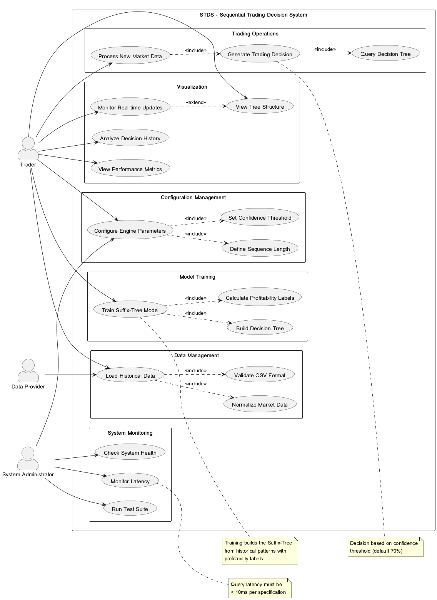
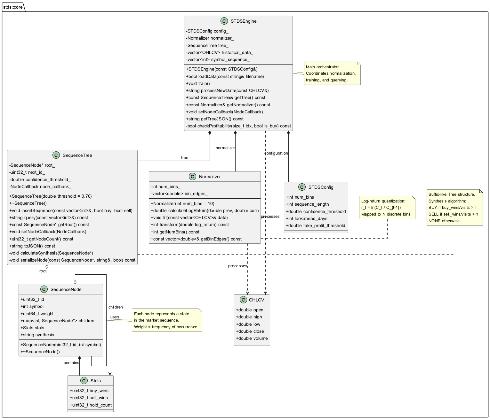
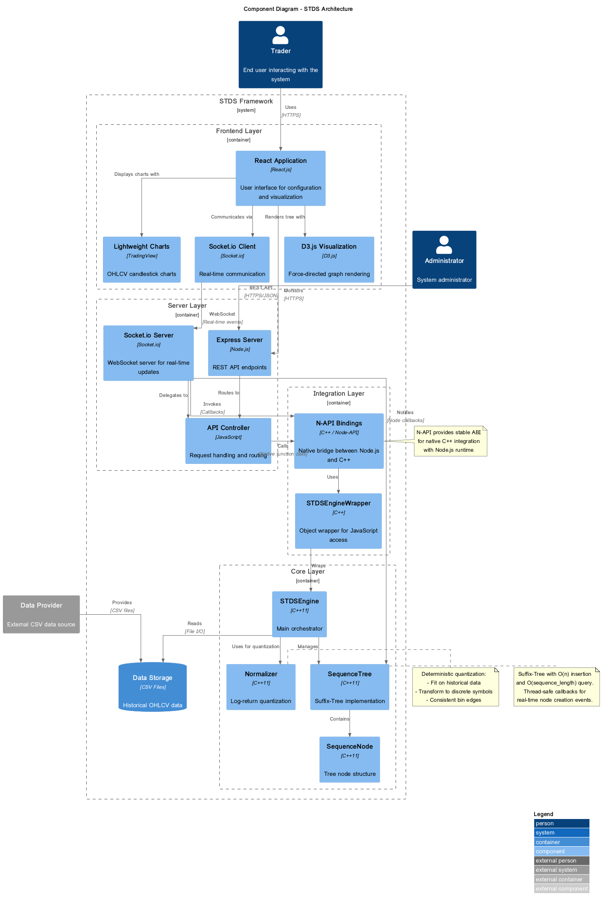
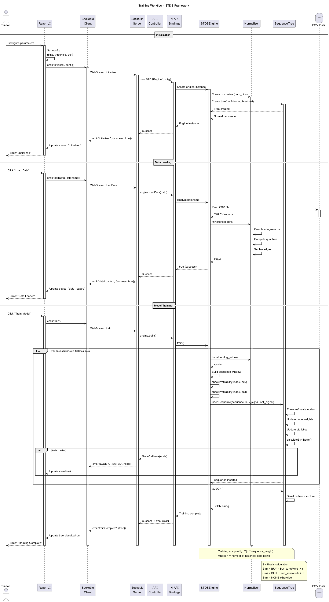
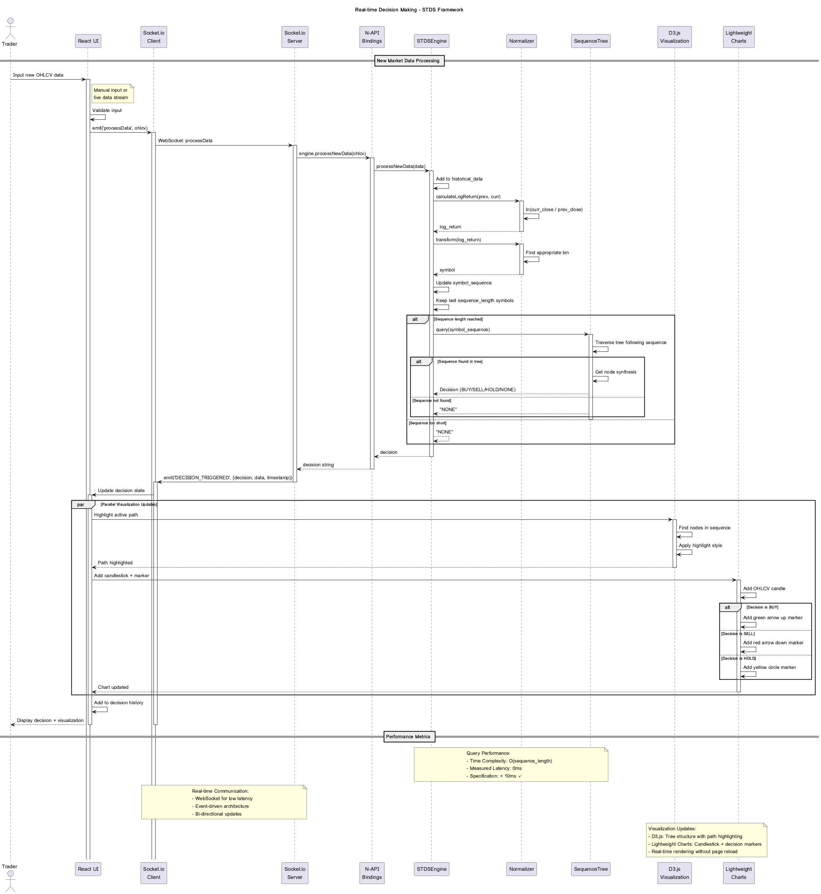

# STDS Framework - UML Documentation

This document provides comprehensive UML diagrams documenting the architecture, design, and behavior of the Sequential Trading Decision System (STDS) framework.

## Table of Contents

1. [Use Case Diagram](#use-case-diagram)
2. [Class Diagram](#class-diagram)
3. [Component Diagram](#component-diagram)
4. [Deployment Diagram](#deployment-diagram)
5. [Sequence Diagrams](#sequence-diagrams)
6. [State Diagram](#state-diagram)
7. [Activity Diagram](#activity-diagram)

---

## Use Case Diagram

**Purpose**: Illustrates the functional requirements and interactions between actors and the STDS system.



### Key Use Cases

#### Configuration Management
- **UC1**: Configure Engine Parameters
- **UC2**: Set Confidence Threshold
- **UC3**: Define Sequence Length

#### Data Management
- **UC4**: Load Historical Data
- **UC5**: Validate CSV Format
- **UC6**: Normalize Market Data

#### Model Training
- **UC7**: Train Suffix-Tree Model
- **UC8**: Calculate Profitability Labels
- **UC9**: Build Decision Tree

#### Trading Operations
- **UC10**: Process New Market Data
- **UC11**: Generate Trading Decision
- **UC12**: Query Decision Tree

#### Visualization
- **UC13**: View Tree Structure
- **UC14**: Monitor Real-time Updates
- **UC15**: Analyze Decision History
- **UC16**: View Performance Metrics

#### System Monitoring
- **UC17**: Check System Health
- **UC18**: Monitor Latency
- **UC19**: Run Test Suite

### Actors

- **Trader**: Primary user who configures, trains, and uses the system for trading decisions
- **System Administrator**: Manages system health, monitoring, and testing
- **Data Provider**: External entity providing historical OHLCV data

---

## Class Diagram

**Purpose**: Shows the static structure of the C++ core layer, including classes, attributes, methods, and relationships.



### Core Classes

#### OHLCV
Simple data structure for market data:
- `double open, high, low, close, volume`

#### Stats
Trading statistics for each node:
- `uint32_t buy_wins` - Successful buy signals
- `uint32_t sell_wins` - Successful sell signals
- `uint32_t hold_count` - Neutral outcomes

#### SequenceNode
Represents a state in the market sequence:
- `uint32_t id` - Unique node identifier
- `int symbol` - Quantized market state
- `uint64_t weight` - Frequency of occurrence
- `map<int, SequenceNode*> children` - Child nodes
- `Stats stats` - Trading statistics
- `string synthesis` - Decision (BUY/SELL/HOLD/NONE)

#### Normalizer
Log-return quantization engine:
- **Key Method**: `calculateLogReturn(prev, curr)` - Computes r_t = ln(C_t / C_{t-1})
- **Key Method**: `fit(data)` - Calculates bin edges from historical data
- **Key Method**: `transform(log_return)` - Maps log-return to discrete symbol

#### SequenceTree
Suffix-like tree structure:
- **Key Method**: `insertSequence(sequence, buy, sell)` - Adds sequence with labels
- **Key Method**: `query(sequence)` - Returns trading decision
- **Key Method**: `calculateSynthesis(node)` - Applies confidence threshold algorithm
- **Key Method**: `toJSON()` - Serializes tree for visualization

#### STDSEngine
Main orchestrator:
- **Key Method**: `loadData(filename)` - Loads and normalizes CSV data
- **Key Method**: `train()` - Builds tree from historical patterns
- **Key Method**: `processNewData(ohlcv)` - Generates real-time decision
- **Key Method**: `checkProfitability(index, is_buy)` - Validates trading signals

### Key Relationships

- **Composition**: STDSEngine contains Normalizer and SequenceTree
- **Aggregation**: SequenceTree aggregates SequenceNode instances
- **Association**: All classes use OHLCV for data processing

---

## Component Diagram

**Purpose**: Depicts the high-level architecture and component interactions across all layers.



### Architecture Layers

#### Frontend Layer
- **React Application**: User interface and state management
- **D3.js Visualization**: Force-directed graph rendering
- **Lightweight Charts**: OHLCV candlestick charts
- **Socket.io Client**: Real-time WebSocket communication

#### Server Layer
- **Express Server**: REST API endpoints
- **Socket.io Server**: WebSocket server for real-time events
- **API Controller**: Request routing and handling

#### Integration Layer
- **N-API Bindings**: Native bridge between Node.js and C++
- **STDSEngineWrapper**: C++ object wrapper for JavaScript access

#### Core Layer
- **STDSEngine**: Main orchestrator
- **Normalizer**: Log-return quantization
- **SequenceTree**: Suffix-Tree implementation
- **SequenceNode**: Tree node structure

### Key Interactions

- **Frontend ↔ Server**: HTTPS REST API + WebSocket
- **Server ↔ Bindings**: Native function calls via N-API
- **Bindings ↔ Core**: Direct C++ method invocation
- **Core ↔ Data**: File I/O for CSV reading

---

## Deployment Diagram

**Purpose**: Shows the physical deployment of components across runtime environments.


### Deployment Nodes

#### Client Machine
- **Web Browser**: Hosts React application and visualization libraries
- **Supported Browsers**: Chrome, Firefox, Safari (ES6+ required)

#### Server Machine (Ubuntu 22.04)
- **Node.js Runtime v22.13.0**: Hosts Express and Socket.io servers
- **Native Layer**: C++11 compiled binaries (N-API + Core)
- **File System**: CSV data and log files

#### Build Environment
- **CMake v3.22**: C++ build system
- **node-gyp v9.4**: Native addon compiler
- **GCC v11.4**: C++ compiler

### Network Configuration

- **Frontend Port**: 3000 (development)
- **Server Port**: 3001
- **Protocol**: HTTPS for REST, WebSocket for real-time

### Dependencies

#### Node.js
- express: ^4.18.2
- socket.io: ^4.6.1
- node-addon-api: ^5.0.0

#### Frontend
- react: ^19.2.4
- d3: ^7.9.0
- lightweight-charts: ^5.1.0
- socket.io-client: ^4.8.3

---

## Sequence Diagrams

### Training Workflow

**Purpose**: Details the step-by-step process of training the Suffix-Tree model on historical data.



#### Key Steps

1. **Initialization**
   - User configures parameters (bins, threshold, etc.)
   - Engine creates Normalizer and SequenceTree instances

2. **Data Loading**
   - CSV file is read and parsed
   - Normalizer fits on historical data (calculates bin edges)

3. **Training Loop**
   - For each sequence in historical data:
     - Calculate log-return and transform to symbol
     - Check profitability for buy/sell signals
     - Insert sequence into tree with labels
     - Emit NODE_CREATED events for real-time visualization

4. **Synthesis Calculation**
   - For each node: S(n) = BUY if buy_wins/visits > τ
   - Update node synthesis field

5. **Completion**
   - Serialize tree to JSON
   - Emit trainComplete event
   - Update frontend visualization

#### Performance

- **Complexity**: O(n × sequence_length) where n = data points
- **Measured Time**: 0-20ms for sample data

---

### Decision Making Workflow

**Purpose**: Shows the real-time process of generating trading decisions from new market data.



#### Key Steps

1. **Input New Data**
   - User inputs OHLCV data (manual or live stream)
   - Validate input format

2. **Normalization**
   - Calculate log-return: r_t = ln(C_t / C_{t-1})
   - Transform to discrete symbol using bin edges

3. **Sequence Update**
   - Add symbol to sequence buffer
   - Keep last `sequence_length` symbols

4. **Tree Query**
   - Traverse tree following symbol sequence
   - Retrieve synthesis from final node
   - Return decision (BUY/SELL/HOLD/NONE)

5. **Visualization Update**
   - Highlight active path in D3.js graph
   - Add candlestick + decision marker to chart
   - Update decision history

#### Performance

- **Query Complexity**: O(sequence_length)
- **Measured Latency**: 0ms (< 10ms specification) ✓

---

## State Diagram

**Purpose**: Models the lifecycle states of the STDS engine and valid state transitions.


### States

1. **Disconnected**: No WebSocket connection
2. **Connected**: WebSocket established, ready for initialization
3. **Initialized**: Engine created with configuration
4. **Data Loaded**: Historical data loaded and normalized
5. **Training**: Building Suffix-Tree from sequences
6. **Trained**: Model ready for predictions
7. **Processing**: Generating decision for new data
8. **Error**: Exception occurred, requires intervention

### State Transitions

- **Disconnected → Connected**: WebSocket connection opened
- **Connected → Initialized**: `initialize(config)` called
- **Initialized → Data Loaded**: `loadData(filename)` successful
- **Data Loaded → Training**: `train()` invoked
- **Training → Trained**: Training complete
- **Trained → Processing**: `processNewData(ohlcv)` called
- **Processing → Trained**: Decision generated
- **Any → Error**: Exception thrown
- **Error → Previous State**: Retry operation

### State Behaviors

#### Training State
- **Entry**: Emit 'training_started' event
- **Do**: For each sequence, insertSequence() and emit NODE_CREATED
- **Exit**: Emit 'training_complete' event

#### Trained State
- **Entry**: Emit 'trained' event
- **Do**: Enable query mode
- **Exit**: Cleanup resources

#### Processing State
- **Entry**: Start latency timer
- **Do**: Normalize, query tree, emit DECISION_TRIGGERED
- **Exit**: Log latency

---

## Activity Diagram

**Purpose**: Illustrates the detailed workflow and decision logic during the training process.


### Training Process Flow

1. **Validation**
   - Check if engine is initialized
   - Check if data is loaded

2. **Initialization**
   - Retrieve fitted bin edges from Normalizer
   - Initialize sequence buffer

3. **Main Loop** (for each data point)
   - Calculate log-return
   - Transform to symbol
   - Add to buffer
   
4. **Sequence Processing** (when buffer full)
   - Extract sequence window
   - **Fork**: Check buy profitability in parallel with sell profitability
   - **Lookahead Algorithm**:
     ```
     for i = 1 to lookahead_days:
       return_pct = (price[t+i] - price[t]) / price[t]
       if return_pct >= take_profit_threshold:
         return TRUE
     return FALSE
     ```

5. **Tree Insertion**
   - Traverse tree following sequence
   - Create new nodes if needed
   - Emit NODE_CREATED events
   - Increment node weights

6. **Statistics Update**
   - Update buy_wins if buy signal
   - Update sell_wins if sell signal
   - Update hold_count if no signal

7. **Synthesis Calculation**
   - Calculate decision based on confidence threshold
   - S(n) = BUY if buy_wins/visits > τ (default 0.70)
   - S(n) = SELL if sell_wins/visits > τ
   - S(n) = NONE otherwise

8. **Completion**
   - Serialize tree to JSON
   - Calculate tree statistics
   - Emit trainComplete event
   - Update frontend visualization

### Decision Logic

#### Confidence Threshold Example
```
visits = 100
buy_wins = 75
buy_ratio = 0.75 > 0.70 (threshold)
synthesis = "BUY"
```

#### Profitability Check
- **Lookahead Days**: 5 (default)
- **Take Profit Threshold**: 2% (default)
- **Logic**: If price moves ≥2% in favorable direction within 5 days → signal is profitable

---

## Diagram Files

All UML diagrams are available in PlantUML format for easy modification:

- `docs/uml/use-case-diagram.puml`
- `docs/uml/class-diagram-core.puml`
- `docs/uml/component-diagram.puml`
- `docs/uml/deployment-diagram.puml`
- `docs/uml/sequence-diagram-training.puml`
- `docs/uml/sequence-diagram-decision.puml`
- `docs/uml/state-diagram.puml`
- `docs/uml/activity-diagram-training.puml`

### Regenerating Diagrams

To regenerate PNG images from PlantUML source:

```bash
cd docs/uml
manus-render-diagram <diagram>.puml <diagram>.png
```

---

## Summary

These UML diagrams provide a complete architectural and behavioral documentation of the STDS framework:

- **Use Case**: Functional requirements and user interactions
- **Class**: Static structure of C++ core
- **Component**: High-level architecture and layers
- **Deployment**: Physical deployment and runtime environment
- **Sequence**: Step-by-step workflows for training and decision making
- **State**: Engine lifecycle and state transitions
- **Activity**: Detailed training process with decision logic

All diagrams are kept in sync with the implementation and serve as both documentation and design reference.

---

**Last Updated**: February 19, 2026  
**Version**: 1.0.0  
**Status**: Complete ✅
